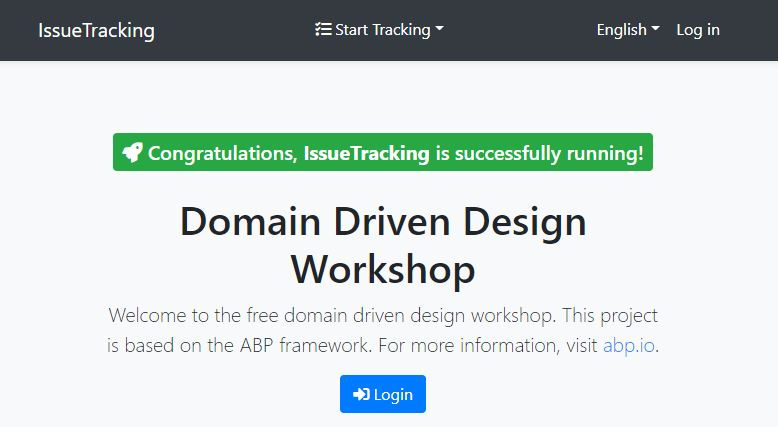

# Get Started

The easiest way to get started is to [clone this repository](#clone-this-repository) into your computer.

## Clone this repository

### Requirements

- .NET 5.0 SDK
- Microsoft SQL Server Express
- Visual Studio Code (Visual Studio 2019 16.8.0+ or another compatible IDE)
  
### Clone this repository into your computer

- Open a command prompt and run the command below to clone the repo into your computer

```bash
    git clone https://github.com/bartvanhoey/DomainDrivenDesignWorkshop.git
```

### Restore Unresolved dependencies

Open the cloned repository in VsCode and click on the **Restore** button to restore the *unresolved dependencies* when a _notification_ pops up in VsCode.

 

### Apply migrations and seed initial data

- Select *DbMigratorDevelopment* in the *debug dropdown* and **hit F5** to start the *IssueTracking.DbMigrator* project. Running this project will apply the migrations and seed the initial data.
  
#### Run and Stop the ABP application

- Select *ApiDevelopment* in the *debug dropdown* and **hit F5** to start the *IssueTracking.HttpApi.Host* project.
- Navigate to the *applicationUrl* specified in the *launchSettings.json* file of the *IssueTracking.HttpApi.Host* project. You should get the **SwaggerUI** window.

    

- Open a command prompt in the *IssueTracking.Blazor* folder and enter `dotnet watch run` below to run the Blazor UI project.
- Navigate to the *applicationUrl* specified in the *launchSettings.json* file of the *IssueTracking.Blazor* project. You should get the **Domain Driven Design Workshop** window.

    

- Stop both the API (by pressing SHIFT+F5) and the Blazor project (by pressing `CTRL+C`).

[Home](../../README.md) | [Part 1: What Is Domain Driven Design](../part1/part1-What-Is-Domain-Driven-Design.md)
