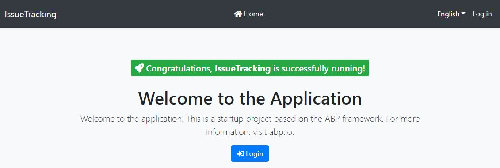

# Get Started

The easiest way to get started is to [clone this repository](#clone-this-repository) into your computer, another way is to [start from scratch](#start-from-scratch). It's up to you!

## Clone this repository


## Start from scratch


## Requirements

The following tools are needed to follow along.

- ABP CLI
- .NET 5.0 SDK
- Microsoft SQL Server Express
- Visual Studio Code (Visual Studio 2019 16.8.0+ or another compatible IDE)
- [ABPx](https://marketplace.visualstudio.com/items?itemName=BartVanHoey.abpx) - VsCode Extension with code snippets to speed up ABP Blazor development

## Initial Workshop Setup

### Creating a new Application

- Open a command prompt and install or update the **ABP CLI**

```bash
dotnet tool install -g Volo.Abp.Cli || dotnet tool update -g Volo.Abp.Cli
```

- Use the following ABP CLI command to create a **new Blazor ABP application**

```bash
abp new IssueTracking -u blazor
```

### Open the Application in Visual Studio Code and install ABPx VsCode extension

Although you don't have to [install ABPx](https://marketplace.visualstudio.com/items?itemName=BartVanHoey.abpx), it will help you to write code faster in an ABP Blazor application as it provides you with a lot of useful code snippets.

- Open the solution in VsCode. Goto the Extensions tab and install the **ABPx extension** first.
  
- When opening an ABP application, VsCode will show 2 notifications (if not, hit CTRL+SHIFT+P to Restart OmniSharp).

    

- Click **Yes** to add the *required assets to build and debug* your application. Select the *IssueTracking.HttpApi.Host* project in the *Select the project to launch* dropdown.

- Click on the **Restore** button to restore the *unresolved dependencies*.

- Replace the content of *launch.json* by copying [this](https://raw.githubusercontent.com/bartvanhoey/WorkshopDDD/main/.vscode/launch.json) file or hit **xLaunchJson** (ABPx code snippet that inserts launch configurations needed).

- Replace the content of *tasks.json* by copying [this](https://raw.githubusercontent.com/bartvanhoey/WorkshopDDD/main/.vscode/tasks.json) file or hit **xTasksJson** (ABPx code snippet that inserts dotnet tasks needed).

### Apply migrations and seed initial data

- Open a *Command Prompt* in the *IssueTracking.DbMigrator* project and hit `dotnet run` to apply the migrations and seed the initial data.
  
### Run and Stop the ABP application

- Select *ApiDevelopment* in the *debug dropdown* and **hit F5** to start the *IssueTracking.HttpApi.Host* project.
- Navigate to the *applicationUrl* specified in the *launchSettings.json* file of the *IssueTracking.HttpApi.Host* project. You should get the **SwaggerUI** window.

    

- Open a command prompt in the *IssueTracking.Blazor* folder and enter `dotnet watch run` below to run the Blazor UI project.
- Navigate to the *applicationUrl* specified in the *launchSettings.json* file of the *IssueTracking.Blazor* project. You should get the **ABP.IO Welcome window**.

    

- Stop both the API (by pressing SHIFT+F5) and the Blazor project (by pressing `CTRL+C`).

[Home](../../README.md) | [Part 2: What Is Domain Driven Design](../part2/part2-What-Is-Domain-Driven-Design.md)
